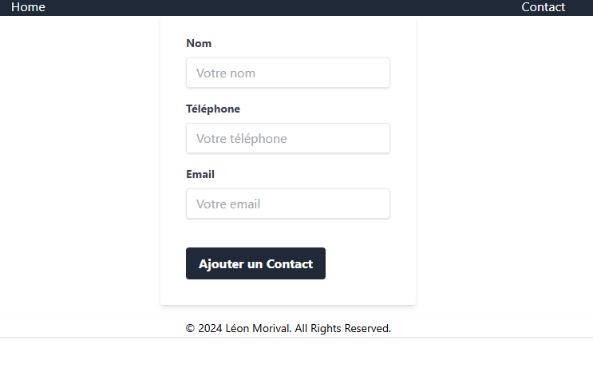
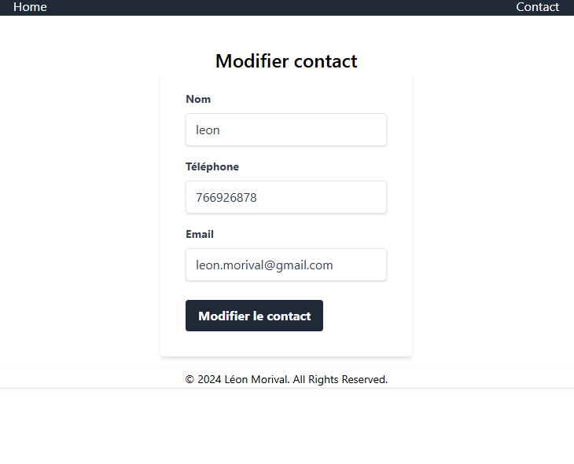
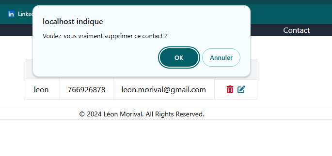

# Projet Formulaire PHP

## Description

Ce projet est une application web simple utilisant PHP, MySQL et Tailwind CSS pour gérer des contacts. Les utilisateurs peuvent ajouter, afficher, modifier et supprimer des contacts.

## Prérequis

Avant de commencer, vous devez avoir les outils suivants installés sur votre machine :

- [PHP](https://www.php.net/downloads.php)
- [MySQL](https://dev.mysql.com/downloads/)
- [Node.js](https://nodejs.org/en/download/) (pour Tailwind CSS)

## Installation

### Étapes d'installation

1. Clonez le projet

2. Installez les dépendances npm

```bash
npm install
npm run build:css
```

3. Configurez la connexion à la base de données MySQL :

```bash
cp db.default.php db.php
```

Modifier les informations de connexions nécessaires à la connection

# Captures d'écran





